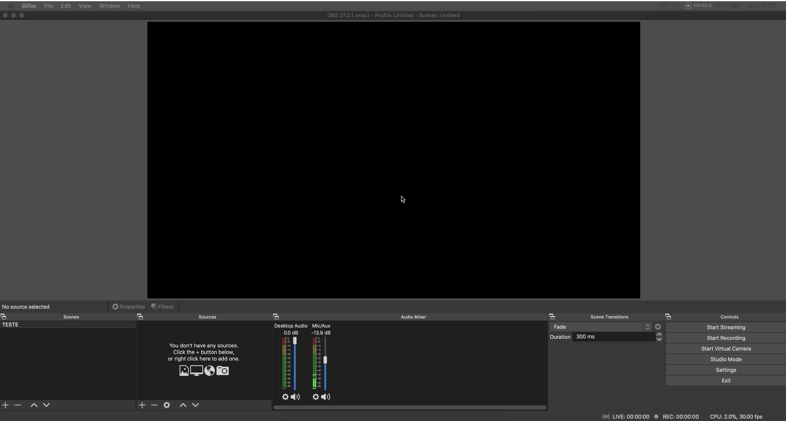
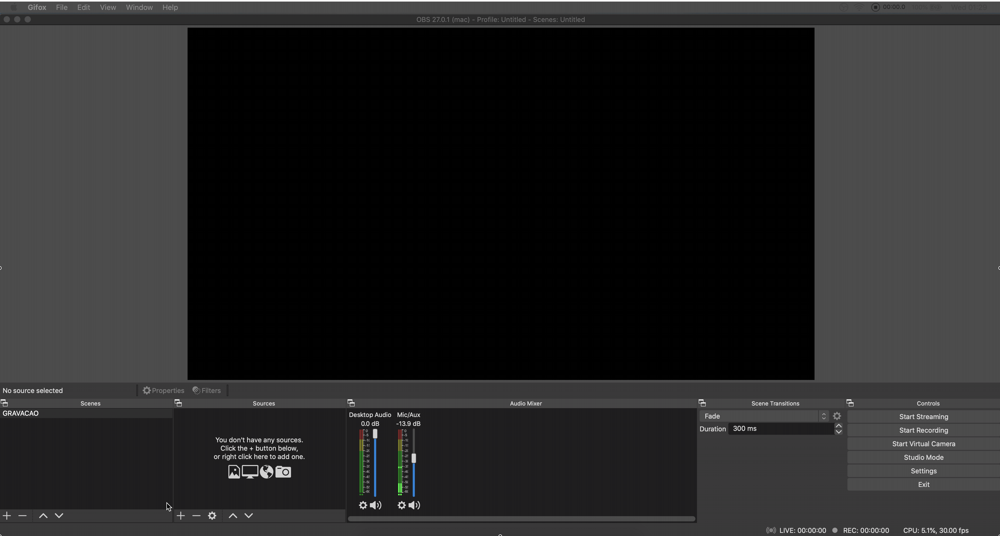
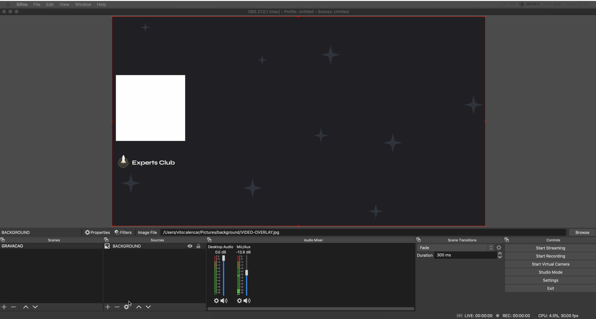
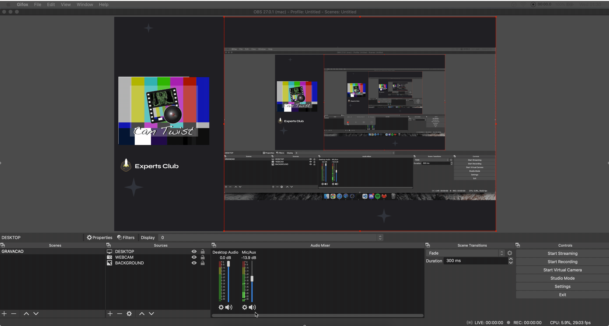

## Gravação por conta própria

Oi pessoal tudo bem com vocês 👋
criei esse video  para ajudar vocês creators no processo de gravação do vídeo dos seus videos
nele vou explicar exatamente o setup do meu OBS para que eu possa gravar as aulas com a melhor qualidade possível
quais as configurações e cuidados que eu tenho antes de gravar.

## Ferramentas 🧰

Pra esse tutorial vamos utilizar o OBS por isso vamos iniciar
fazendo o download a utima versão [dowload](https://obsproject.com)

## Primeiros passos 🏁

Renomeie a sua cena principal

Adicione o seu o background

Adicione o a sua captura de tela

Adicione a captura da sua webcam

Configure o seu microfone e teste o nivel do som

# Resultado Final 🎥

## Expert

|  |
| :-----------------------------------------------------------------------------------------------------------------------------------------------------------------: |
|                                                          [Vitor Alencar](https://github.com/vitormalencar)                                                          |

## Licença

Feito com ♥ e ☕️ por [vitormalencar](https://vitormalencar.com). Licenciado sob a [Licença MIT](licença).
